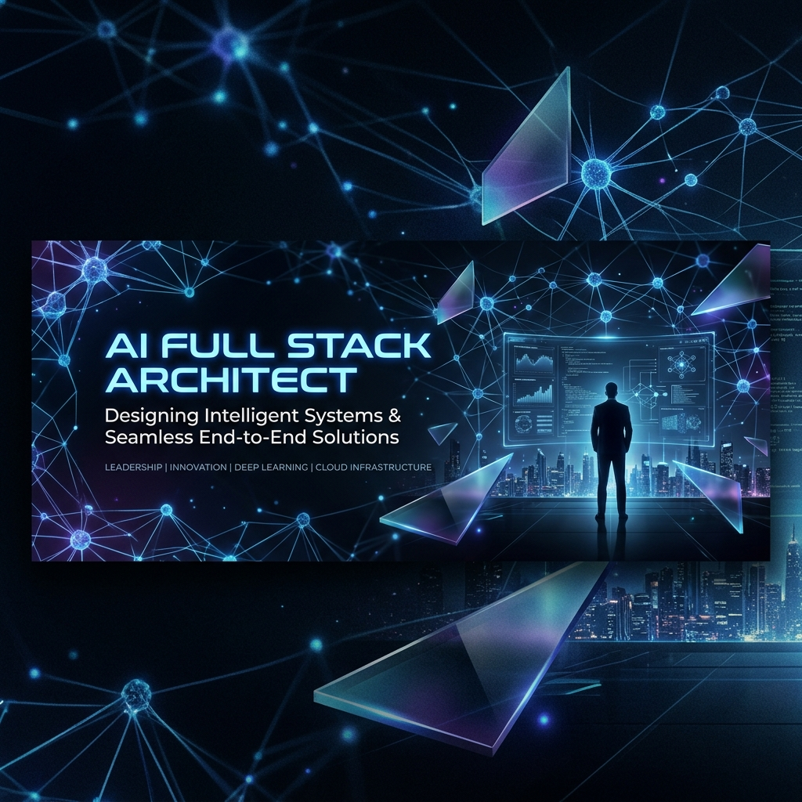

# Ananthapadmanabhan DS | AI Full Stack Architect 🚀

  

---

### 🌌 The Vision
I am a multi-disciplinary **AI Full Stack Developer** and **Product Engineer** dedicated to bridging the gap between cutting-edge AI research and production-grade engineering. With a focus on **Autonomous Agents**, **Scalable RAG**, and **High-Performance Systems**, I architect software that doesn't just process data—it reasons, adapts, and scales.

---

### 🏗️ Engineering Pillars

| Role | Expertise Focus | Technical Architecture |
| :--- | :--- | :--- |
| **🤖 AI Engineer** | LLM Orchestration, Agentic Workflows. | LangGraph, Multi-Agent Chains, Vector Embeddings. |
| **🔬 AI Research Engineer** | SOTA RAG, Multimodal Intelligence. | Transformer Architectures, Semantic Chunking, Eval-driven dev. |
| **🛠️ Backend Engineer** | High-performance API design. | Rust/FastAPI Microservices, Distributed Systems, gRPC. |
| **🎨 Frontend Developer** | Immersive, cinematic UIs. | Next.js, Three.js (R3F), Framer Motion, Tailwind. |
| **📦 Product Engineering** | Enterprise-scale AI products. | Event-driven architecture, CI/CD, Observability stacks. |

---

### 💻 Technical Arsenal

  <!-- Core Programming -->
  
  
  
  
  
  

  <!-- Advanced Languages & Automation -->
  
  
  
  
  

  <!-- Web Frameworks & APIs -->
  
  
  
  
  
  

  <!-- AI, ML & Computer Vision -->
  
  
  
  
  

  <!-- Data Engineering & Infrastructure -->
  
  
  
  
  
  

  <!-- Tools & Modern UI -->
  
  
  
  
  
  

---

#### 1. [Autonomous AI Software Engineer](https://github.com/Ananthapadmanabhan333/Self-Writing-and-Self--Testing-Autonomous-AI-Software-Engineer)
> **Technical Structure**: 
> - **Core**: LangGraph-based Directed Acyclic Graph (DAG) for task planning.
> - **Execution**: Sandboxed Docker environments for code execution and testing.
> - **Self-Healing**: Recursive error-correction loop triggered by PyTest failures.
> - **Stack**: Python, LangChain, GPT-4, Docker.

#### 2. [Enterprise RAG Operating System](https://github.com/Ananthapadmanabhan333/Enterprise-RAG-Operating-System)
> **Technical Structure**:
> - **Ingestion**: Scalable semantic chunking pipeline with metadata enrichment.
> - **Retrieval**: Hybrid search (Dense + Sparse) via Pinecone and ChromaDB.
> - **Frontend**: Next.js Dashboard with real-time RAG visualization.
> - **Stack**: TypeScript, Pinecone, FastAPI, OpenAI.

#### 3. [BlackBox Governance Platform](https://github.com/Ananthapadmanabhan333/Black-Box)
> **Technical Structure**:
> - **Monitoring**: Real-time middleware for intercepting LLM I/O.
> - **Security**: Regex and ML-based prompt injection detection layer.
> - **UI**: Cinematic glassmorphism dashboard for agent trace visualization.
> - **Stack**: Next.js, Framer Motion, PostgreSQL, Python.

#### 4. [Sub-Second Latency Voice AI](https://github.com/Ananthapadmanabhan333/Sub-Second-Latency-Voice-AI)
> **Technical Structure**:
> - **Pipeline**: WebSocket-based streaming (VAD -> ASR -> LLM -> TTS).
> - **Concurrency**: Asynchronous processing with Groq for inference acceleration.
> - **Stack**: TypeScript, WebSocket, Whisper-V3, Groq, Deepgram.

---

### 📂 Master Engineering Index (121 Repositories)

<b>🌌 Architectural Sovereignty (Singularity & Omega)</b>

<blockquote><b>Architecture:</b> Core "Operating System" architectures for autonomous intelligence at scale. Exascale environments with real-time telemetry.</blockquote>

- [Social-Mind-Singularity-](https://github.com/Ananthapadmanabhan333/Social-Mind-Singularity-) | **Structure:** Behavioral Intelligence OS | *Python*
- [DEVOS-Singularity](https://github.com/Ananthapadmanabhan333/DEVOS-Singularity) | **Structure:** AI-Native Engineering OS | *TypeScript*
- [Civic-AI-Singularity](https://github.com/Ananthapadmanabhan333/Civic-AI-Singularity) | **Structure:** National Infrastructure Platform | *Python*
- [Legacy-X-Singularity](https://github.com/Ananthapadmanabhan333/Legacy-X-Singularity) | **Structure:** Enterprise Migration OS | *TypeScript*
- [Synapse-ERP-Singularity](https://github.com/Ananthapadmanabhan333/Synapse-ERP-Singularity) | **Structure:** Autonomous Enterprise OS | *TypeScript*
- [QuantumShield-Omega](https://github.com/Ananthapadmanabhan333/QuantumShield-Omega) | **Structure:** Cybersecurity OS Framework | *TypeScript*
- [Titan-Scheduler-Omega](https://github.com/Ananthapadmanabhan333/Titan-Scheduler-Omega) | **Structure:** Distributed GPU Arbiter | *TypeScript*

<b>🛡️ Trust, Security & Digital Forensics</b>

<blockquote><b>Architecture:</b> Autonomous trust layers, security middlewares, and forensic intelligence engines.</blockquote>

- [Black-Box](https://github.com/Ananthapadmanabhan333/Black-Box) | **Structure:** Agentic Security & Trust Layer | *TypeScript*
- [ARES-X](https://github.com/Ananthapadmanabhan333/ARES-X) | **Structure:** Distributed Forensics System | *TypeScript*
- [Prompt-Injection-Detector](https://github.com/Ananthapadmanabhan333/Prompt-Injection-Detector) | **Structure:** Security Middleware | *TypeScript*
- [AI-Security-Vulnerability-Detector-and-Auto-Fixer](https://github.com/Ananthapadmanabhan333/AI-Security-Vulnerability-Detector-and-Auto-Fixer) | **Structure:** Self-Healing Security Agent | *Python*

<b>💹 Fintech & Quantitative Intelligence</b>

<blockquote><b>Architecture:</b> High-frequency risk engines and cognitive financial intelligence frameworks.</blockquote>

- [Quantmind](https://github.com/Ananthapadmanabhan333/Quantmind) | **Structure:** Quantitative Risk Engine | *Python*
- [AstraQuant-X](https://github.com/Ananthapadmanabhan333/AstraQuant-X) | **Structure:** Autonomous Trading Engine | *Python*
- [Financial-Reality-Stimulator](https://github.com/Ananthapadmanabhan333/Financial-Reality-Stimulator) | **Structure:** Monte Carlo Agent | *TypeScript*
- [CashScope-AI](https://github.com/Ananthapadmanabhan333/CashScope-AI) | **Structure:** Intelligent FinTech Dashboard | *TypeScript*

<b>⚖️ Legal-Tech & Intellectual Property</b>

<blockquote><b>Architecture:</b> AI-driven claim intelligence and legal risk scoring engines.</blockquote>

- [Patent-](https://github.com/Ananthapadmanabhan333/Patent-) | **Structure:** PatentIQ Infringement Engine | *Research*

<b>📡 Infrastructure & Real-Time Response</b>

<blockquote><b>Architecture:</b> Disaster response, blockchain toolchains, and environment optimization.</blockquote>

- [Aegis-Global](https://github.com/Ananthapadmanabhan333/Aegis-Global) | **Structure:** Disaster Response OS | *TypeScript*
- [acton](https://github.com/Ananthapadmanabhan333/acton) | **Structure:** TON Blockchain Toolchain | *C++*
- [Environment-optimization-service](https://github.com/Ananthapadmanabhan333/Environment-optimization-service) | **Structure:** Resource Lifecycle Manager | *Go*
- [Reputation-score-Platform](https://github.com/Ananthapadmanabhan333/Reputation-score-Platform) | **Structure:** Decentralized Scoring | *TypeScript*

<b>🏢 Enterprise Decision Intelligence</b>

<blockquote><b>Architecture:</b> Decision engines designed to detect inefficiencies and simulate high-level reasoning.</blockquote>

- [synaspse_ai](https://github.com/Ananthapadmanabhan333/synaspse_ai) | **Structure:** Cognitive Enterprise Engine | *Python*
- [AdSpectra-OS](https://github.com/Ananthapadmanabhan333/AdSpectra-OS) | **Structure:** Autonomous Marketing OS | *TypeScript*
- [Freelancer-CRM-with-AI](https://github.com/Ananthapadmanabhan333/Freelancer-CRM-with-AI) | **Structure:** Intelligent CRM Dashboard | *TypeScript*

<b>🌍 Social Impact & Cognitive Intelligence</b>

<blockquote><b>Architecture:</b> Behavioral telemetry, inclusion OS, and cultural intelligence analysis.</blockquote>

- [karmlink](https://github.com/Ananthapadmanabhan333/karmlink) | **Structure:** Worker OS for Informal Workforce | *TypeScript*
- [Neurosync-X](https://github.com/Ananthapadmanabhan333/Neurosync-X) | **Structure:** Behavioral Intent Telemetry | *TypeScript*
- [astrux](https://github.com/Ananthapadmanabhan333/astrux) | **Structure:** Astra Cultural IQ Engine | *Python*
- [neurodiversity_ai](https://github.com/Ananthapadmanabhan333/neurodiversity_ai) | **Structure:** Cognitive Inclusion Engine | *Python*

<b>🏥 Health & Wellness Automation</b>

- [Medicine](https://github.com/Ananthapadmanabhan333/Medicine) | [BioNexus-AI](https://github.com/Ananthapadmanabhan333/BioNexus-AI) | [MEDSIGHT](https://github.com/Ananthapadmanabhan333/MEDSIGHT)
- [fitness_excuss](https://github.com/Ananthapadmanabhan333/fitness_excuss) | [gym-excuse-gen](https://github.com/Ananthapadmanabhan333/gym-excuse-gen) | [openhuman](https://github.com/Ananthapadmanabhan333/openhuman)
- [AI-for-healthcare](https://github.com/Ananthapadmanabhan333/AI-for-healthcare) | [burnout-recovery-clinics](https://github.com/Ananthapadmanabhan333/burnout-recovery-clinics)

<b>🧠 Academic Foundations & DSA</b>

- [Data-Structures](https://github.com/Ananthapadmanabhan333/Data-Structures) | [Algorithms](https://github.com/Ananthapadmanabhan333/Algorithms) | [system-design-notes](https://github.com/Ananthapadmanabhan333/system-design-notes)
- [interview-company-wise-problems](https://github.com/Ananthapadmanabhan333/interview-company-wise-problems) | [CSE-AIML-AI-lab-Program](https://github.com/Ananthapadmanabhan333/CSE-AIML-AI-lab-Program) | [AI-Lab](https://github.com/Ananthapadmanabhan333/AI-Lab)

<b>🎨 Personal Brand & Professional Assets</b>

- [portfolio](https://github.com/Ananthapadmanabhan333/portfolio) | [Personal-Website](https://github.com/Ananthapadmanabhan333/Personal-Website) | [Biography-page](https://github.com/Ananthapadmanabhan333/Biography-page)
- [Universal-Master-Prompt](https://github.com/Ananthapadmanabhan333/Universal-Master-Prompt) | [500-AI-Agents-Projects](https://github.com/Ananthapadmanabhan333/500-AI-Agents-Projects)

